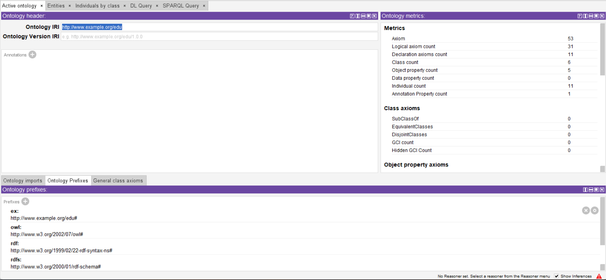
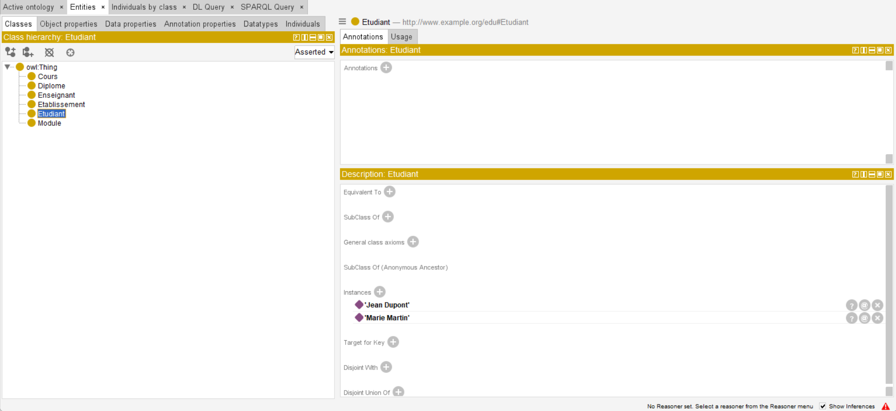
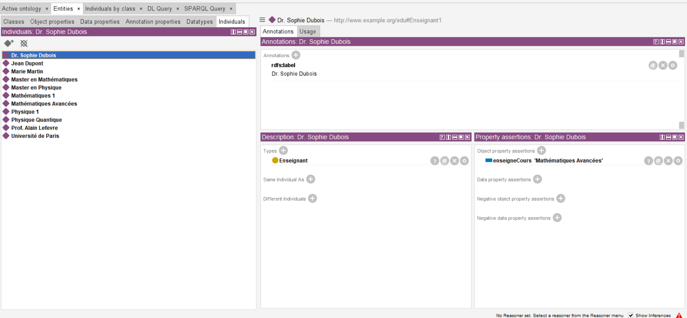

# Projet semantique

## Phase 1 : Choix du domaine

### Domaine sélectionné : **Éducation**

### Justification du choix

J'ai choisi le domaine **de l'éducation** car il est central dans la société et contient des concepts riches à modéliser. Il est universel, bien structuré et possède de nombreux **acteurs** (étudiants, enseignants, établissements), **ressources** (cours, documents, examens), et **relations** (un étudiant suit un cours, un enseignant enseigne, etc.).

Ce domaine est idéal pour une modélisation sémantique car :

- Il est riche en **concepts réutilisables** dans d’autres ontologies.
- Il contient des relations **fortement typées et hiérarchisées**.
- Il permet de montrer la puissance de l’inférence via **OWL** et **SWRL**.

### Concepts clés identifiés

| Concept                | Description                                              |
|------------------------|----------------------------------------------------------|
| **Étudiant**           | Personne inscrite dans un établissement d’enseignement   |
| **Enseignant**         | Personne chargée de dispenser des cours                  |
| **Cours**              | Unité d’enseignement suivie par des étudiants            |
| **Établissement**      | Institution comme une université ou école                |
| **Matière**            | Sujet ou thème d’un cours (ex : Math, Informatique)      |
| **Niveau**             | Cycle de formation (Licence, Master, Doctorat)           |
| **Document pédagogique** | Support de cours, devoir, polycopié                    |

## Phase 2 : Modélisation en RDF/RDFS et OWL

### Justification des **namespaces**

| Namespace      | URI                                              | Usage                                       |
|----------------|--------------------------------------------------|---------------------------------------------|
| **rdf**        | http://www.w3.org/1999/02/22-rdf-syntax-ns#      | Syntaxe RDF                                 |
| **rdfs**       | http://www.w3.org/2000/01/rdf-schema#            | Définition de classes et propriétés         |
| **owl**        | http://www.w3.org/2002/07/owl#                   | Langage d’ontologie OWL                     |
| **xsd**        | http://www.w3.org/2001/XMLSchema#                | Types de données                            |
| **ex**         | http://www.example.org/edu#                      | Namespace propre au projet                  |

### Description des classes

| Classe           | Description                                    |
|------------------|------------------------------------------------|
| **Etudiant**     | Représente un étudiant                         |
| **Enseignant**   | Représente un enseignant                       |
| **Cours**        | Représente un cours                            |
| **Module**       | Représente un ensemble de cours                |
| **Diplome**      | Représente un diplôme attribué                 |
| **Etablissement**| Représente une université ou école             |

### Propriétés et relations

| Propriété               | Domaine        | Portée         | Description                                   |
|-------------------------|----------------|----------------|-----------------------------------------------|
| **suitCours**           | Etudiant       | Cours          | Un étudiant suit un cours                     |
| **enseigneCours**       | Enseignant     | Cours          | Un enseignant enseigne un cours               |
| **faitPartieDuModule**  | Cours          | Module         | Un cours appartient à un module               |
| **appartientADiplome**  | Module         | Diplome        | Un module appartient à un diplôme             |
| **offreDiplome**        | Etablissement  | Diplome        | Un établissement offre un diplôme             |

## Phase 3 : Interrogation avec SPARQL

### Requête 1 : Obtenir tous les étudiants et les cours qu’ils suivent

```sparql
SELECT ?nomEtudiant ?nomCours
WHERE {
  ?etudiant a ex:Etudiant ;
            rdfs:label ?nomEtudiant ;
            ex:suitCours ?cours .
  ?cours rdfs:label ?nomCours .
}
```

**Signification** : Cette requête permet de lister tous les étudiants ainsi que les cours qu’ils suivent, en affichant leurs noms.

---

### Requête 2 : Trouver les enseignants et les cours qu’ils enseignent

```sparql
SELECT ?nomEnseignant ?nomCours
WHERE {
  ?enseignant a ex:Enseignant ;
              rdfs:label ?nomEnseignant ;
              ex:enseigneCours ?cours .
  ?cours rdfs:label ?nomCours .
}
```

**Signification** : Affiche tous les enseignants avec leurs noms ainsi que les cours qu’ils dispensent.

---

### Requête 3 : Lister les modules et les cours qui en font partie

```sparql
SELECT ?nomModule ?nomCours
WHERE {
  ?cours a ex:Cours ;
         rdfs:label ?nomCours ;
         ex:faitPartieDuModule ?module .
  ?module rdfs:label ?nomModule .
}
```

**Signification** : Permet de voir la structure pédagogique : quels cours font partie de quels modules.

---

### Requête 4 : Trouver les diplômes offerts par un établissement

```sparql
SELECT ?nomEtablissement ?nomDiplome
WHERE {
  ?etablissement a ex:Etablissement ;
                 rdfs:label ?nomEtablissement ;
                 ex:offreDiplome ?diplome .
  ?diplome rdfs:label ?nomDiplome .
}
```

**Signification** : Liste les diplômes proposés par chaque établissement.

---

## Captures d'ecran

**Ontology**


**Vue des classes**
.

**Propiétés objet**
.

**Individus**
.

